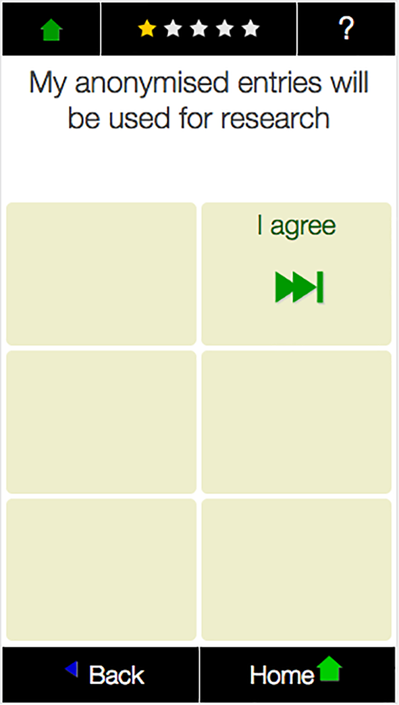

% METER data
% Data Documentation
% April 2019

Introduction
============

Measuring and Evaluating Time-use and Electricity-use Relationships (METER) is a project collecting and depositing data on household electricity use, activities and other contextual and demographic information. This documentation explains the data collection process, the structure of the data and how to use it.

METER is a 5 year research project at the University of Oxford's Environmental Change Institute. It is funded by the Engineering and Physical Sciences Research Council (EPSRC) from 2015-2020 under grant number [EP/M024652/1](https://gow.epsrc.ukri.org/NGBOViewGrant.aspx?GrantRef=EP/M024652/1).

Aims
----

METER seeks to improve our understanding of household electricity use, its timing, flexibility and societal importance. By combining high resolution household electricity readings with simultaneous activity records of household members, METER data provides a platform for new analytical insights.

These include among others a more detailed understanding of socio-technical drivers behind

- high and low electricity consumption
- high peak time consumption
- ability to respond the load shifting interventions
- impact of interventions on individuals
- trends in electricity use over time and in response to adoption of new technologies and social practices

Statistics
----------

The data deposited in March 2019 is summarised in Table 1.

Table: Statistics of the METER data deposition March 2019

Property                          |  Records 
---------                         |---------
Earliest record                   | 17 Feb 2016
Latest record                     | 18 Jan 2019
Households registered             | 414
Households participated           | 361
Distinct households               | 293
&nbsp;                            | &nbsp;
*Electricity*                     | &nbsp;
Complete electricity records      | 264
Electricity readings (1 minute)   | 596396
Electricity readings (10 minutes) | 60085
&nbsp;                            | &nbsp;
*Activities*                      | &nbsp; 
Activity recorders issued         | 743
Activity records                  | 529
Activities reported               | 16378
Paper diaries                     | 134
App based diaries                 | 395


A complete electricity record in Table 1 refers to records with good electricity readings. Some households attached the recorder shortly after the study period begins and still returned some valid data. Some of the registered households have not yet taken part, while others have done the study more than once.

This document has two main parts. Under [Data collection](#data-collection) the recruitment process and data collection instruments are explained. The [Data deposition](#data-deposition) section introduces the data tables, their relationships and the meaning of fields, columns and values.


Data collection
===============

The data collection process involves the following stages:

#. [Recruitment](#recruitment)
#. [Household Survey](#household-survey)
#. [Participation](#participation)
    #. [Individual Survey](#individual-survey)
    #. [Activity Recording](#activity-recording)
    #. [Electricity Recording](#electricity-recording)
#. [Follow-up Surveys](#follow-up-surveys)

Each of these steps is briefly explained here.

Recruitment
------------

Thus far METER's participation has been on a voluntary opt-in basis. The following approaches have been used to promote the study:

- Local radio and television appearances
- Public engagement and visiting community events
- Posters (see [poster.pdf](./poster.pdf)) and flyers
- Working with [project partners](http://www.energy-use.org/about.php#partners)
- University press release
- Social media
- Snowballing (email existing participants to invite others, with the promise that the person with the most references wins a year free electricity)
- Collaboration with other studies and initiatives

From January 2018 onwards the Household survey captures the source of referrals.

No explicit rewards are offered, but each year one participant can win the cash equivalent of one year off their electricity bill. See [terms and conditions](http://www.energy-use.org/how_it_works.php "How it works").

Participant consent
-------------------

Consent for participation and data usage is sought at three points:

1.  At the end of the [Household Survey](#household-survey)
2.  Via email, prior to the parcel being sent out
3.  At the start of the [Individual Survey]()

At the end of the [Household Survey](#hhSurvey) participants are made aware of
the data policy as shown in Figure 1.


The data policy is available [online](http://www.energy-use.org/data_policy.php) and states:

> **You own the data**
> 
> Electricity load data may seem innocuous, but it can contain a lot of personal information, such as when and for how long you were at home. In combination with the activity information even more personal insights are possible. We therefore treat these data as personal and sensitive.
> 
> It is important to us that you remain in charge of the data. If for any reason you become uncomfortable about us holding information from you, you are entitled to ask us to remove the data - no questions asked.
>
    
> **Your consent**
> 
> You owning the data also means that we will not share data without your consent.
> 
> By taking part in this study you consent to your data being used for research purposes. For any additional use, we will ask your consent first.
> 
> **How we use your data**
> 
> There are different levels of access we would grant:
> 
> Your name and address: These will not be shared under any circumstances. We may identify your region based on your post code, but not beyond street level. Your survey information: These will only be used for research and may be made accessible to other researchers. Wider access is only available in aggregated or fragmented form. That means your information is combined with others, such that your individual data cannot be recognised. Your activity information: Researchers will have access to these data. We may also like to share examples of activity data with the public, provided you have given consent explicitly. Otherwise we will only share aggregated data (i.e. combined with enough others that make it impossible to identify individuals). Your load profile: We treat your electricity data with the same level of sensitivity as your activity data. How we store your data: All of the data we collect, is stored on a secure server within a relational SQL database. Your name and address are stored separately from your survey information and your electricity readings. The only thing that links these data is an ID number we generate for you.



Finally, before participants complete the individual survey on the
activity recorder, they *have to* agree to their data to be used for
research, as shown in Figure 2.


Household Survey
----------------

Prospective participants register their interest to participate by completing a Household survey on [energy-use.org](http://www.energy-use.org).

Data collected includes (see [Household table](#household) for questions and range of answers):

- Contact information
    - Name
    - Address
    - Email
- Household composition
    - Number and ages of household members (Figure 3)
    - Pets
    - Typical occupancy
- Building
    - House type
    - Size of house
    - Ownership
    - Appliances (Figure 4)
- Electricity
    - Supplier
    - Tariff
    - Expenditure
    - Affordability
    - Household income
- Preferred date to take part


 

 

Participation
-------------

The electricity recorder is scheduled to automatically switch on and start recording at 5pm on a given day of the week (Monday to Sunday). The devices are therefore charged, configured and sent six days prior to the study day, such that their next start-up is the recording day. Participating households receive the envelope 2-4 days prior to their chosen date. 

The envelope contains:

- A note with instructions explaining the content of the parcel and next steps (Figure 5)
- An activity recorder (Figure 6) for each household member aged 8 or above 
- A booklet with instruction for the activity recorder (see [booklet.pdf](./booklet.pdf))
- An electricity recorder (Figure 11)
- A prepaid return envelope


Before January 2017 participants received a paper diary instead of an activity recorder (see [diary.pdf](./diary.pdf)).

Activity and electricity recordings are taken over a 28 hour period starting at 5pm, thus capturing two of the typically most energy intensive periods between 5pm and 7pm. We refer to this 28 hour period as a 'study day' (even though it has 4 more hours than a day).


Activity recording
------------------


Activity recorders (aMeters) are issues as a pre-installed app on an Alcatel Pixi 4 smart phone device. All other phone features are disabled, except the power button, which can toggle the device on/off. The devices are thus configured to only provide two functions:

1.  [Individual survey](#individual-survey) completion and
2.  [Activity recording](#activity-recording)

The interface is specifically designed to be failsafe and intuitive. No sliders, gestures or nested menus exist. All operations are a choice of 6 large buttons on a 2 by 3 grid (Figure 7). The only exception is the home screen where reported activities are chronologically listed in scrollable form.


Individual Survey
-----------------

The aMeter prompts each participant to complete an Individual Survey covering:

-   Consent for data to be used for research
-   Personal information
       -   Gender
       -   Age range (Figure 7)
-   Work
       -   Occupation type
       -   Working hours
       -   Flexibility of working hours
       -   Working from home
-   Financial
        -   Contribute to electricity bills
        -   Personal income
-   Frequency/duration of use
        -   Appliances (Dishwasher, washing machine...)
        -   Activities (Screen time, cooking, exercise...)

See detailed questions and data structure in Section [Individual](#individual).

Once the survey is completed the first star lights up on the activity recorder and the reporting of activities will lead to up to 5 stars being earned for 25 activities.

Activity Recording
------------------

From the home screen a new activity can be entered via the "now" button.
If the event is in the past or future, the "recent" button allows for
the time to be adjusted, before the entry sequence begins.

The entry sequence follows the standard pattern in Figure 8.


An example of a possible entry sequence is shown in Figure 9.


The decision tree with six branches per screen quickly leads to a
detailed description of activities.


*Editing an existing activity*

Tapping an activity on the home screen opens up the 6 editing options shown in Figure 10. These can be:

-   add another activity that took place in parallel
-   repeat that (past) activity now
-   change the caption of the activity (time use code remains unchanged)
-   change the time of the activity
-   report the activity as ended
-   delete the activity

Section Activities explains how activity records are processed and stored.

*Source code*

The Meter app is an open source project ([github:MeterApp](https://github.com/philgrunewald/meterapp)). More information about the app is published by [Grunewald (2017)](https://www.eceee.org/library/conference_proceedings/eceee_summer_studies/2017/9-consumption-and-behaviour/what-we-do-matters-8211-a-time-use-app-to-capture-energy-relevant-activities/).

The app keeps function and content separated. All button labels, captions and help files are stored as plain text json files which can be modified or translated without coding experience. A German version of the app has been developed and further internationalisation and customisation is encouraged. The files containing the sequence of screens and buttons with labels, icons and time-use codes is also in the public domain ([github:MeterActivities](https://github.com/philgrunewald/meteractivities)).


Electricity recording
---------------------

Electricity recorders (eMeters) are preconfigured to record electricity over a 28 hour period. Participants attach the current clamp beneath their mains electricity meter prior to the study period. Instructions are printed on the case. The eMeter is fully automated and has no switches. It does not provide feedback.


Once the devices are returned in a pre-paid envelope the data is downloaded. Units are then recharged and re-deployed with the next participant. For each user the eMeter is issued with a new ID (see [Meta Table](#devices)).

The 50Hz current clamp signal is recorded at 44kHz and sampled down to RMS readings for every second. Values are stored as Watt readings in a csv text file on the device.

While temporal accuracy is high, the recordings are prone to variations between devices (\~5% error) and distortions when the power factor of loads is low. Some devices, especially motors with poor power factor correction, can lead to artificially high readings. To correct for this error it would be necessary to also record the voltage. This would require users to make a physical connection (for example in the fuse box). This has been avoided thus far.

In their current form, the duration of electricity recording is limited to \~42 hours by the battery life of the devices. With booster batteries this duration could be extended.

The main failure mechanism for electricity recorders are:

- tearing of the flexure on the current clamp, often due to difficult access under the meter
- damage to the iron core surrounding the wire, when closing the clamp onto (rather than around) the wire

The electricity recorder is covered by a patent held by Oxford Innovations. 


Follow-up Surveys
-----------------

Within days after returning the equipment, households receive a link to an interactive [visualisation](http://www.energy-use.org/yourdata) of their electricity profile and activities.

The hour of highest electricity consumption is annotated with "Your peak demand". Participants have the opportunity to provide additional information about appliances that may have been in use during this hour from a drop down menu. Simple statistics about minimum, average and peak usage are shown and compared with the study averages.

Data deposition
===============

This Section explains the data structure and how to read and link records, using the following conventions:

-   **Table**: a collection of records (shown in **bold**)
-   `Field`: a column in a **Table** (`mono spaced`)
-   *Record*: row or set of data identified by an ID (*italic*)

The naming convention for a primary key (PK) of Table **X** is

-   `idX`

except for the Electricity tables, where the primary key is always `idElectricity`, even for table **Electricity\_1min** and **Electricity\_10min**.

Fields referring to a primary key in another table **Y** (foreign keys,
or FK) follow the naming convention

-   `Y_idY`.


Schema
------

The data relationships between tables in the Meter database are shown in Figure 13.

`idContact` is generated when a contact registers and their personal information is stored in **Contact**.

The Household Survey information is linked to the contact via the foreign key `Contact_idContact` in **Household**.

Each time an `idContact` takes part in the study, a unique `idHousehold` is generated, which has `idContact` as its foreign key. 
All survey information is copied to the new `idHousehold` and participants can update content if their circumstances have changed.

Any personal information in **Contact** is excluded from this deposition. It is still possible to identify repeat participants via their common `idContact` in the **Household** table.

Recordings in **Activities**, **Individual** and **Electricity** are linked to an `idHousehold` in two steps:

#. Each record has a device `idMeta` with which it was recorded. This is stored as a foreign key (`Meta_idMeta`).
#. **Meta** links this ID with the **Household** via `Household_idHousehold`.

Example: to get all activities for a given ``idHousehold`` = X, one can query:

```sql
    SELECT *
       FROM Activities
       JOIN Meta
         ON idMeta = Meta_idMeta
       WHERE Household_idHousehold = X
```
<!-- ``` -->

The following sections describe fields, the meaning of values, as well as other conventions for each table.

Devices
-------

The **Meta** table keeps a record of devices issued. Each time a recorder (either activity or electricity) is sent out, it is assigned a unique ID (`idMeta`).

Two types of devices are in use:

1.  Activity recorders: either paper diaries, or app based
2.  Electricity recorders: for mains electricity or PV circuits

The device type is identified by `DataType` as shown in Table 2.

Table: Device types

`DataType`   | Meaning
------------ | -------------
A            | Activities
E            | Electricity
P/PV         | PV circuit

The `SerialNumber` conventions further distinguish the type of device as shown in Table 3

Table: Serial number conventions

`SerialNumber`      |  Meaning
------------------  |  -------------------------------------
 0                  |   Paper diary
 1..999             |   aMeter pre-installed
 xxyyd              |   eMeter
 &nbsp;             |   xx = month of study day,
 &nbsp;             |   yy = serial number,
 &nbsp;             |   d = default day to record (0=Sunday)
 16 digit           |   Downloaded app 
 &nbsp;             |   (serial number of mobile device)


`Quality`

The `Quality` value is intended as a means to exclude some data from analysis without deleting it from the database.

For activity recorders `Quality` is automatically assigned to the number of activities reported. If entries are considered erroneous, this value can be set to 0 to exclude them from analysis. A threshold of `Quality` > 6 is recommended, but there is no reason why records with fewer entries may not be valid for some types of analysis.

Electricity and PV recorders get their `Quality` value automatically assigned from the number of hours for which every 10 minute average is 20 Watts or above. Subsequently, profiles are visually inspected for unreasonable readings, resulting from noise or incorrect attachment of the clamp, in which case `Quality` is set to 0. A good record should have `Quality` > 26 (hours).

`CollectionDate` refers to the date of first reading for Electricity, or earliest activity record for Activities.

Household
---------

The **Household** table is populated as part of the online Household Survey. The identity of a household is given by the foreign key `Contact_idContact` (the **Contact** table itself is not available for privacy reasons).

Households participating more than once have a unique `idHousehold` for each study day. The survey information is duplicated and can be modified by the participant if circumstances have changed. It is possible to identify repeat household via their common `Contact_idContact` (unless they re-registered afresh).

The `status` field shows how far a household has progressed through the study process. The states are listed in Table 4.

Table: Status progression through the study

``status``    |  Meaning
-----------   |  ------------------------------------------
0             |  incomplete survey
1             |  survey complete
2             |  no date selected
3             |  date selected
4             |  awaiting confirmation of participation
5             |  devices issued
6             |  devices returned and processed
7             |  data shared with contact
8             |  Follow-up Surveys provided
10..11        |  faulty data
31            |  offered new dates

`page_number` is the last page a contact filled in as part of the Household Survey. When returning to the survey, participants can continue on this page. 

`date_choice` is the date on which a participant chose to take part in the study. It is at 5pm on this day that data collection should commence. It is possible for activities to be recorded before and after this date.

The `study` field distinguishes different phases of the study as shown in Table 5. While the process has been consistent throughout, it may be desirable to separate out participants who used a paper diary, rather than the app.

Table: Study phases identified in **Household**

`study`   | Meaning
--------- | ----------------------------------------
0         | default/not given
1         | early trials, 24 hours
2         | activities entered using paper diaries
3         | activities entered using the METER app
4         | community study (West Oxford)

The `reference` field was introduced in January 2018. Prior entries are *NULL*. The ``referees`` field has been omitted from this deposition for confidentiality reasons. This field can contain the names of people who referred a participant to the study.

The `timestamp` is the date and time when the record was created, i.e. when a participant first signed up.

The full **Household** table with all survey questions and answer ranges is shown in Table 6.

Table: Household table fields and values and original survey questions

Field                | Question and options                                                               | Values
-------------------- | -------------------------------------------                                        | --------
``people``           | How many people live in your household?                                            | &nbsp;
&nbsp;               | 1, just me                                                                         | 1
&nbsp;               | 2-5 people                                                                         | 2-5
&nbsp;               | 6 or more                                                                          | 6
age_group            | Your ages. How many of you in each age group?                                      | #
``age_group1``       | Under 8 .. people                                                                  | &nbsp;
``age_group2``       | Age 8-18 ... people                                                                | &nbsp;
``age_group3``       | Age 19-34 ... people                                                               | &nbsp;
``age_group4``       | Age 35-50 ... people                                                               | &nbsp;
``age_group5``       | Age 51-70 ... people                                                               | &nbsp;
``age_group6``       | Over 70 ... people                                                                 | &nbsp;
&nbsp;               | Your pets. Click any pets you have in the house.                                   | 1: yes
``pet1``             | Dog                                                                                | &nbsp;
``pet2``             | Cat                                                                                | &nbsp;
``pet3``             | Fish                                                                               | &nbsp;
``pet4``             | Other                                                                              | text
``p6pm``             | Who's at home?                                                                     | &nbsp;
&nbsp;               | On a typical weekday how many people would be at home at 6pm?                      | &nbsp;
&nbsp;               | Nobody                                                                             | 0
&nbsp;               | 1 person                                                                           | 1
&nbsp;               | 2-4 people                                                                         | 2-4
&nbsp;               | 5 or more                                                                          | 5
``house_type``       | Your home. What type of house do you live in?                                      | &nbsp;
&nbsp;               | Flat apartment                                                                     | 1
&nbsp;               | Detached house                                                                     | 2
&nbsp;               | Semi-detached house                                                                | 3
&nbsp;               | Terraced house                                                                     | 4
&nbsp;               | Bungalow house                                                                     | 5
&nbsp;               | Other (please specify)                                                             | 6
``house_type_other`` | Other                                                                              | text
``rooms``            | Rooms. How many rooms does your home have?                                         | &nbsp;
&nbsp;               | Not counting kitchen  landing hallways and bathrooms(s)                            | &nbsp;
&nbsp;               | 1 room                                                                             | 1
&nbsp;               | 2-5 rooms                                                                          | 2-5
&nbsp;               | 6 or more                                                                          | 6
``own``              | Your property. Do you own or rent your property?                                   | &nbsp;
&nbsp;               | Own with or without a mortgage                                                     | 1
&nbsp;               | Rent social landlord                                                               | 2
&nbsp;               | Rent private landlord                                                              | 3
appliance_b          | Your appliances. Which of these do you have?                                       | 1: yes
&nbsp;               | Click anything you have in the house.                                              | &nbsp;
``appliance_b1``     | Washing machine                                                                    | &nbsp;
``appliance_b2``     | Tumble Dryer                                                                       | &nbsp;
``appliance_b3``     | Washer Dryer                                                                       | &nbsp;
``appliance_b4``     | Underfloor Heating                                                                 | &nbsp;
``appliance_b5``     | Gas boiler                                                                         | &nbsp;
``appliance_b6``     | Heat pump                                                                          | &nbsp;
&nbsp;               | Your appliances. How about these things? Click anything you have and use           | &nbsp;
``appliance_b7``     | Electric hob                                                                       | &nbsp;
``appliance_b8``     | Electricity display                                                                | &nbsp;
``appliance_b9``     | PV panels                                                                          | &nbsp;
``appliance_b10``    | Solar thermal                                                                      | &nbsp;
``appliance_b11``    | Electric car                                                                       | &nbsp;
appliance            | Your appliances. Do you have any of these items?                                   | #
&nbsp;               | If so click to say how many. Only count things you actually used in the last year. | &nbsp;
``appliance1``       | Dehumidifyer                                                                       | &nbsp;
``appliance2``       | Air conditioner                                                                    | &nbsp;
``appliance3``       | Portable heaters                                                                   | &nbsp;
``appliance4``       | Night storage heaters                                                              | &nbsp;
``appliance5``       | Power shower                                                                       | &nbsp;
``appliance6``       | TV/computer screens                                                                | &nbsp;
``provider``         | Your electricity provider. Who provides your electricity?                          | &nbsp;
&nbsp;               | Good Energy                                                                        | good
&nbsp;               | British Gas                                                                        | bg
&nbsp;               | SSE                                                                                | sse
&nbsp;               | nPower                                                                             | npower
&nbsp;               | e-On                                                                               | eon
&nbsp;               | Scottish Power                                                                     | sp
&nbsp;               | Ecotricity                                                                         | eco
&nbsp;               | EDF                                                                                | edf
&nbsp;               | The co-operative                                                                   | coop
&nbsp;               | Other                                                                              | oth
``tariff``           | Your tariff. Which of these best describes your electricity tariff? Just pick one  | &nbsp;
&nbsp;               | Standard                                                                           | 1
&nbsp;               | Green                                                                              | 2
&nbsp;               | Economy7                                                                           | 3
&nbsp;               | Economy10                                                                          | 4
&nbsp;               | Don't know                                                                         | 5
&nbsp;               | Other                                                                              | 6
``bill_range``       | Your electricity bill. How much do you spend on electricity per year [month]       | &nbsp;
&nbsp;               | £300 [£25] or less                                                                 | 1
&nbsp;               | Up to £400 [£33]                                                                   | 2
&nbsp;               | Up to £550 [£46]                                                                   | 3
&nbsp;               | Up to £700 [£58]                                                                   | 4
&nbsp;               | Up to £850 [£71]                                                                   | 5
&nbsp;               | Up to £850 [£71]                                                                   | 6
``bill_uncertain``   | Not sure                                                                           | 1
``bill_monthly``     | Give bill as monthly figure                                                        | 1
``income``           | Income. What is your household income?                                             | &nbsp;
&nbsp;               | These are annual gross figures. Switch to monthly [annual]                         | &nbsp;
&nbsp;               | [These are net monthly figures after deductions for tax and national insurance]    | &nbsp;
&nbsp;               | Less than £15,000 [1000] a year [month]                                            | 1
&nbsp;               | Less than £25,000 [1500] a year [month]                                            | 2
&nbsp;               | Less than £35,000 [2000] a year [month]                                            | 3
&nbsp;               | Less than £50,000 [3000] a year [month]                                            | 4
&nbsp;               | Less than £70,000 [4000] a year [month]                                            | 5
&nbsp;               | Over £70,000 [4000] a year [month]                                                 | 6
``inc_monthly``      | Give income as monthly figure                                                      | 1
``bill_affordable``  | How affordable do you find your electricity?                                       | &nbsp;
&nbsp;               | Select the statement which best describes the affordability of your electricity    | &nbsp;
&nbsp;               | Not affordable, I struggle to pay                                                  | 1
&nbsp;               | Somewhat affordable, I must budge                                                  | 2
&nbsp;               | Affordable,I can pay                                                               | 3
&nbsp;               | Very affordable,I can easily pay                                                   | 4
``date_choice``      | Which of these dates would suit you to take part?                                  | &nbsp;
&nbsp;               | date 1                                                                             | &nbsp;
&nbsp;               | date 2                                                                             | &nbsp;
&nbsp;               | date 3                                                                             | &nbsp;
&nbsp;               | none of these                                                                      | &nbsp;
``reference``        | How did you hear about this study?                                                 | &nbsp;
&nbsp;               | Facebook                                                                           | 1
&nbsp;               | Event                                                                              | 2
&nbsp;               | Poster                                                                             | 3
&nbsp;               | Radio                                                                              | 4
&nbsp;               | Email                                                                              | 4
&nbsp;               | Friend or other                                                                    | 5

The default value is '0'. The default `date_choice` is '2000-01-01' if no date has yet been selected. The ``provider`` defaults to 'not given'. ``p6pm``, which could meaningfully be '0' has a default of '-1' to indicate a missing value. For some fields a missing value can be ambiguous. Appliances may be '0' because they are not present or because they were omitted when filling the survey.


Individual
----------

This table contains results from the [Individual Survey](#individual-survey). Any question can be skipped, in which case the default value is '0'. 

Table: Individual survey questions and answer ranges

Field                 | Question / options                                                           | value
-------------------   | ---------------------------------------                                      | ------
``Gender``            | What gender are you?                                                         | &nbsp;
&nbsp;                | Female                                                                       | 1
&nbsp;                | Male                                                                         | 2
&nbsp;                | Other                                                                        | 3
``Age_range``         | What age group are you?                                                      | &nbsp;
&nbsp;                | 8-19                                                                         | 1
&nbsp;                | 19-34                                                                        | 2
&nbsp;                | 35-50                                                                        | 3
&nbsp;                | 50-70                                                                        | 4
&nbsp;                | Over 70                                                                      | 5
&nbsp;                | Skip                                                                         | 6
``Occupation``        | What is your occupation?                                                     | &nbsp;
&nbsp;                | Student                                                                      | 1
&nbsp;                | Employed                                                                     | 2
&nbsp;                | Self-employed                                                                | 3
&nbsp;                | Volunteer/unpaid work                                                        | 4
&nbsp;                | Unemployed/retired                                                           | 5
&nbsp;                | Skip                                                                         | 6
``WorkingHours``      | How many hours do you work per week?                                         | &nbsp;
&nbsp;                | None                                                                         | 1
&nbsp;                | 1-15                                                                         | 2
&nbsp;                | 16-30                                                                        | 3
&nbsp;                | 31-45                                                                        | 4
&nbsp;                | Over 45                                                                      | 6
&nbsp;                | Skip                                                                         | 6
``WorkRegularity``    | Are these hours always the same?                                             | &nbsp;
&nbsp;                | Always the same                                                              | 1
&nbsp;                | Variable to suit work                                                        | 2
&nbsp;                | Flexible to suit me                                                          | 3
&nbsp;                | Skip                                                                         | 4
``WorkHome``          | How often do you work from home?                                             | &nbsp;
&nbsp;                | Never                                                                        | 1
&nbsp;                | Rarely                                                                       | 2
&nbsp;                | Sometimes                                                                    | 3
&nbsp;                | Often                                                                        | 4
&nbsp;                | Always                                                                       | 5
&nbsp;                | Skip                                                                         | 6
``BillContributer``   | Do you pay the electricity bills?                                            | &nbsp;
&nbsp;                | Yes, I do                                                                    | 1
&nbsp;                | I contribute                                                                 | 2
&nbsp;                | I don't                                                                      | 3
&nbsp;                | Other/skip                                                                   | 4
``Income``            | Roughly, what is your annual income?                                         | &nbsp;
&nbsp;                | £0 - £10,000                                                                 | 1
&nbsp;                | up to £20,000                                                                | 2
&nbsp;                | up to £30,000                                                                | 3
&nbsp;                | up to £45,000                                                                | 4
&nbsp;                | Over £45,000                                                                 | 5
&nbsp;                | Skip                                                                         | 6
``UseDishwasher``     | In the last 7 days, did you personally use a Dishwasher?                     | &nbsp;
&nbsp;                | I didn't                                                                     | 1
&nbsp;                | Once                                                                         | 2
&nbsp;                | Twice                                                                        | 3
&nbsp;                | 3-4 times                                                                    | 4
&nbsp;                | 5-7 times                                                                    | 5
&nbsp;                | 8 or more                                                                    | 6
``UseWashingMachine`` | In the last 7 days did you personally use a Washing Machine?                 | &nbsp;
&nbsp;                | I didn't                                                                     | 1
&nbsp;                | Once                                                                         | 2
&nbsp;                | Twice                                                                        | 3
&nbsp;                | 3-4 times                                                                    | 4
&nbsp;                | 5-7 times                                                                    | 5
&nbsp;                | 8 or more                                                                    | 6
``UseTumbleDryer``    | In the last 7 days did you personally use a Tumble Dryer?                    | &nbsp;
&nbsp;                | I didn't                                                                     | 1
&nbsp;                | Once                                                                         | 2
&nbsp;                | Twice                                                                        | 3
&nbsp;                | 3-4 times                                                                    | 4
&nbsp;                | 5-7 times                                                                    | 5
&nbsp;                | 8 or more                                                                    | 6
``UseShower``         | In the last 7 days did you use a Shower?                                     | &nbsp;
&nbsp;                | I didn't                                                                     | 1
&nbsp;                | Once                                                                         | 2
&nbsp;                | Twice                                                                        | 3
&nbsp;                | 3-4 times                                                                    | 4
&nbsp;                | 5-7 times                                                                    | 5
&nbsp;                | 8 or more                                                                    | 6
``UseVacuumCleaner``  | In the last 7 days did you use a Vacuum Cleaner?                             | &nbsp;
&nbsp;                | I didn't                                                                     | 1
&nbsp;                | Once                                                                         | 2
&nbsp;                | Twice                                                                        | 3
&nbsp;                | 3-4 times                                                                    | 4
&nbsp;                | 5-7 times                                                                    | 5
&nbsp;                | 8 or more                                                                    | 6
``TimeMobile``        | On a typical weekday how much time do you spend on Mobile Devices (in total) | &nbsp;
&nbsp;                | None                                                                         | 1
&nbsp;                | 10min or less                                                                | 2
&nbsp;                | 30min or less                                                                | 3
&nbsp;                | 1h or less                                                                   | 4
&nbsp;                | 2h or less                                                                   | 5
&nbsp;                | Over 2h                                                                      | 6
``TimeScreens``       | On a typical weekday how much time do you spend on Screens (any device)      | &nbsp;
&nbsp;                | None                                                                         | 1
&nbsp;                | 30min or less                                                                | 2
&nbsp;                | 1h or less                                                                   | 3
&nbsp;                | 2h or less                                                                   | 4
&nbsp;                | 3h or less                                                                   | 5
&nbsp;                | Over 3h                                                                      | 6
``TimeCooking``       | On a typical weekday how much time do you spend Cooking                      | &nbsp;
&nbsp;                | None                                                                         | 1
&nbsp;                | 30min or less                                                                | 2
&nbsp;                | 1h or less                                                                   | 3
&nbsp;                | 2h or less                                                                   | 4
&nbsp;                | 3h or less                                                                   | 5
&nbsp;                | Over 3h                                                                      | 6
``TimeExercise``      | On a typical weekday how much time do you spend Exercising
&nbsp;                | None                                                                         | 1
&nbsp;                | 10min or less                                                                | 2
&nbsp;                | 10min or less                                                                | 3
&nbsp;                | 1h or less                                                                   | 4
&nbsp;                | 3h or less                                                                   | 5
&nbsp;                | Over 3h                                                                      | 6
``EnergyInterest``    | How interested are you in energy issues?                                     | &nbsp;
&nbsp;                | Very Interested                                                              | 1
&nbsp;                | Interested                                                                   | 2
&nbsp;                | Somewhat                                                                     | 3
&nbsp;                | Not very much                                                                | 4
&nbsp;                | Not at all                                                                   | 5
&nbsp;                | Skip                                                                         | 6


Activities
----------

All activities are precoded on the aMeter. Paper diaries were processed using the same app and coding structure.

Table: Activity table fields and value ranges

Field                 | Description /Options                            | Values
------                | --------------                                  | ------------------
``idActivities`` (PK) | Activity ID                                     | int
``Meta_idMeta`` (FK)  | Recording device ID                             | int
``dt_activity``       | Time of activity                                | DATETIME
``dt_recorded``       | Time of reporting                               | DATETIME
``location``          | Where are you?                                  | &nbsp;
&nbsp;                | Home                                            | 1
&nbsp;                | Travelling                                      | 2
&nbsp;                | - foot                                          | 21
&nbsp;                | - bike                                          | 22
&nbsp;                | - car                                           | 23
&nbsp;                | - public transport                              | 24
&nbsp;                | Work                                            | 3
&nbsp;                | Public place                                    | 4
&nbsp;                | Outdoors                                        | 5
&nbsp;                | Garden                                          | 6
&nbsp;                | Other                                           | 7
``activity``          | What are you doing?                             | text
``tuc``               | Time Use Code                                   | 0..9999
``category``          | Activity category                               | &nbsp;
&nbsp;                | &nbsp;                                          | care_self
&nbsp;                | &nbsp;                                          | care_others
&nbsp;                | &nbsp;                                          | food
&nbsp;                | &nbsp;                                          | recreation
&nbsp;                | &nbsp;                                          | work
&nbsp;                | &nbsp;                                          | care_house
&nbsp;                | &nbsp;                                          | care_other
&nbsp;                | &nbsp;                                          | other_category
``people``            | How many people are you doing this with?        | &nbsp;
&nbsp;                | No one                                          | 0
&nbsp;                | 1 other                                         | 1
&nbsp;                | 2 people                                        | 2
&nbsp;                | 3 people                                        | 3
&nbsp;                | 4 people                                        | 4
&nbsp;                | More than 4                                     | 5
``enjoyment``         | How much are you enjoying this?                 | &nbsp;
&nbsp;                | Not at all                                      | 1
&nbsp;                | Not much                                        | 2
&nbsp;                | So so                                           | 3
&nbsp;                | Somewhat                                        | 4
&nbsp;                | Very much                                       | 5
&nbsp;                | 'undefined'                                     | 0
``path``              | Entry sequence                                  | tuc  ID list

Default value is 0, unless this is an option, as for ``people``, where the default is '-1' instead.

Electricity
-----------

Electricity consumption is recorded every second and downsampled to mean values every 1 minute and 10 minutes (**Electricity\_1min**, **Electricity\_10min**). The `Watt` values correspond to the period beginning at `dt`, i.e. they span from `dt` to `dt` + 10 minutes.

Table: Electricity table fields

Field             |  Description/Comment
-------------     |  -------------------
``idElectricity`` |  Primary key
``Meta_idMeta``   |  Recording device ID
``dt``            |  Time of reading (datetime)
``Watt``          |  Power in Watt (float)

A full record covers 28 hours, starting at 5 pm. Prior to 18 April 2016 records were only 24 hours, starting at 4 am.

The noise level of the recorder is 2-5 Watt. Readings of less than 20 Watt tend to suggest that the recorder was not attached properly. 

Legend
------

The **Legend** table gives access to many of the survey questions and field meanings provided in this documentation. These can be convenient to labelling results during analysis. It describes field entries in the **Household**, **Individual**, and **Activities** tables. 

`tab` contains the name of the table and `col` the name of the field. 

The remaining ``value``-``meaning`` pairs give the meaning for a range of possible values for this field. Where the range of values is open (counts and free text), no legend is provided.

The survey questions that were asked of participants is denoted with ``value``='q'.

Example: the meaning of a value '1' in **Household** field ``own`` is 

```sql
    SELECT meaning 
        FROM Legend 
        WHERE `tab` == 'Household' 
        AND `col`   == 'own' 
        AND `value` == '1';
``` <!-- ``` -->

returns: "Own, With or without a mortgage"

Or, to establish the original question for `people`, one can query:

```sql
    SELECT meaning 
        FROM Legend 
        WHERE `tab` == 'Household' 
        AND `col`   == 'people' 
        AND `value` == 'q';
``` <!-- ``` -->

returns: "How many people live at this address?"

Note that questions are truncated to 45 characters. For full wording of questions, refer to this documentation.

Table: Legend table with meaning of values in other tables

Field         |  Description
------------- |  -------------------
 ``idLegend`` |  Primary key
 ``tab``      |  Name of reference table:  **Household**    ,  **Individual**  or  **Activities**
 ``col``      |  Field in reference table
 ``value``    |  Range of values ('q' = survey question)
 ``meaning``  |  Explanation of corresponding entry


Resources
=========

Publications
------------

The following publications give an introduction to the METER study.

1.  Philipp Grunewald, Russell Layberry, *ECEEE Summer Proceedings* (2015). [Measuring the relationship between time-use and electricity consumption](https://www.eceee.org/library/conference_proceedings/eceee_Summer_Studies/2015/9-dynamics-of-consumption/measuring-the-relationship-between-time-use-and-electricity-consumption/)

    Introducing the methodology for recording activities and electricity alongside each other.

2.  Philipp Grunewald, Marina Diakonova, Davide Zilli, Jessica Bernard, Adriano Matousek, *ECEEE Summer Proceedings* (2017). [What we do matters – a time-use app to capture energy relevant activities](https://www.eceee.org/library/conference_proceedings/eceee_Summer_Studies/2017/9-consumption-and-behaviour/what-we-do-matters-8211-a-time-use-app-to-capture-energy-relevant-activities/)

    An introduction to the activity recording app and its features

3. Phil Grunewald, Marina Diakonova, *Energy and Buildings* (2018) [The electricity footprint of household activities - implications for demand models](https://www.sciencedirect.com/science/article/pii/S0378778818306935)

    Outlines initial findings and tests the strength of activities to predict electricity use. We conclude that for multi-occupant households in particular the multiplicity of parallel activities does not support the use of activities as a strong indicator of household electricity use. The difference between activities with 'high' and 'low' electricity use is only around 7% at aggregated household level.

4. Philipp Grunewald, Marina Diakonova, *Energy Research & Social Science* (38) 58-66 (2018). [Flexibility, dynamism and diversity in energy supply and demand: A critical review](https://www.sciencedirect.com/science/article/pii/S2214629618300744) 

    The importance of everyday life limiting even largely technical solutions for load shifting is brought into focus through a systematic review of flexibility options. 


Further publications can be found on Academia.edu:
[Academia](https://oxford.academia.edu/PhilippGr%C3%BCnewald)

Online Resources
----------------

Meter project developments are disseminated online via:

-   [Facebook/EnergyUse](https://www.facebook.com/EnergyUse/)
-   [Twitter/EnergyUseUK](https://twitter.com/EnergyUseUK)
-   [Academia/PhilippGrunewald](https://oxford.academia.edu/PhilippGr%C3%BCnewald)
-   [Energy-use.org](http://www.energy-use.org)

This documentation is maintained on

-   [GitHub MeterData
    repository](https://github.com/philgrunewald/MeterData).

