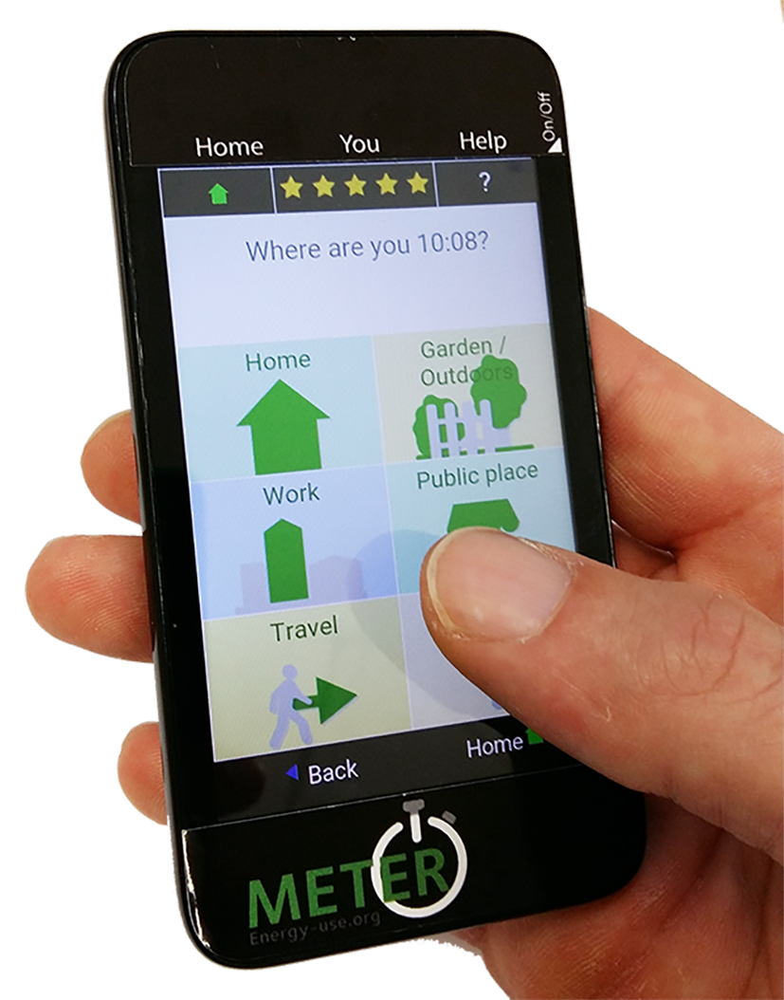

METER data
==========

Measuring and Evaluating Time-use and Electricity-use Relationships (METER) is a project collecting and depositing data on household electricity use, activities and other contextual and demographic information. This documentation explains the data collection process, the structure of the data and how to use it.

METER is a 5 year research project at the University of Oxford's Environmental Change Institute. It is funded by the Engineering and Physical Sciences Research Council (EPSRC) from 2015-2020 under grant number EP/M024652/1.

Aims
----

METER seeks to improve our understanding of household electricity use, its timing, flexibility and societal importance. By combining high resolution household electricity readings with simultaneous activity records of household members, METER data provides a platform for new analytical insights.

These include among others a more detailed understanding of socio-technical drivers behind

- high and low electricity consumption
- high peak time consumption
- ability to respond the load shifting interventions
- impact of interventions on individuals
- trends in electricity use over time and in response to adoption of new technologies and social practices

Data collection
===============

The data collection process involves the following stages:

#. `Recruitment`_
#. `Household Survey`_
#. `Individual Survey`_
#. `Activity Recording`_
#. :ref:`Electricity Recording <eMeter>`
#. `Follow-up Surveys`_

Each of these steps is briefly explained here.

Recruitment
------------

Thus far METER's participation has been on a voluntary opt-in basis. The following approaches have been used to promote the study:

- Local radio and television appearances
- Public engagement and visiting community events
- :download:`Posters <images/meter_poster3.png>` and flyers
- Working with project partners
- University press release
- Social media
- Snowballing (email existing participants to invite others, with the promise that the person with the most references wins a year free electricity)
- Collaboration with other studies and initiatives

From January 2018 onwards any referrals (one of the ways in which participants learn about the study) are recorded as part of the Household Survey (see `Household.reference` and `Household.referee`).

No explicit rewards are offered, but each year one participant can win the cash equivalent of one year of their electricity bill (see `How it works <http://www.energy-use.org/how_it_works.php>`_)

.. Biases arising from self-section are discussed under :ref:`representativity`.

The section [to provide link] on Recruitment Materials provides examples of advertising used in attracting participants to the METER study.

Household Survey
---------------------------------------

Prospective participants register their interest on energy-use.org by completing a Household survey.

Data collected includes:

- Contact information
    - Name
    - Address
    - Email
- Household composition
    - Number and ages of household members
    - Pets
    - Typical occupancy
- Building
    - House type
    - Size of house
    - Ownership
    - Appliances
- Electricity
    - Supplier
    - Tariff
    - Expenditure
    - Affordability
    - Household income
- Preferred date to take part

See :ref:`questions and optional answers <household-table>` for a detailed break down of the survey.

Meter's `data privacy policy <http://energy-use.org/data_policy.php>`_
is available from the final screen of the Household Survey.

.. figure:: images/envelope.png
  :scale: 40 %
  :align: right

Participation
-------------

Participating households receive an envelope 2-4 days prior to their chosen date. Parcels cannot be posted more than 7 days in advance, because the `eMeter`_ is activated on a given weekday and would discharge prior to arriving.

The envelope contains:

* A :download:`note with instructions <images/Monday.png>` explaining the content of the parcel and next steps

* A prepaid return envelope

* An :ref:`eMeter`

* An :ref:`aMeter` for each household member aged 8 or above

* a booklet explaining the `aMeter`_ (:download:`aMeter instructions <images/17_03_aMeter_booklet.png>`)

Before January 2017 participants received a :download:`paper diary <images/meter_booklet_v10.png>` instead.

Activity and electricity recordings are taken over a 28 hour period starting at 5pm, thus capturing two of the typically most energy intensive periods between 5pm and 7pm. We refer to this 28 hour period as a 'study day'.

.. _aMeter:

Activity Recorder (aMeter)
---------------------------------------

aMeters are issues as a pre-installed app on a budget smart phone (Alcatel Pixi 4). All other phone features are disabled, except the power button, which can toggle the device on/off. The devices are thus configured to only provide two functions:

#. `Individual Survey`_ completion
#. `Activity Recording`_

The interface is specifically designed to be fail save and intuitive. No sliders, gestures or nested menus exist. All operations are a choice of 6 large buttons on a 2 by 3 grid. The only exception is the home screen where reported activities are chronologically listed in scrollable form.

.. figure:: images/survey.png
    :scale: 60 %
    :align: right

Individual Survey
-----------------

The `aMeter`_ prompts each participant to complete an Individual Survey covering:

- Consent for data to be used for research
- Personal information
    - Gender
    - Age range
- Work
    - Occupation type
    - Working hours
    - Flexibility of working hours
    - Working from home
- Financial
    - Contribute to electricity bills
    - Personal income
- Frequency/duration of use
    - Appliances (Dishwasher, washing machine...)
    - Activities (Screen time, cooking, exercise...)

See detailed :ref:`questions and data structure <individual>`.

Once the survey is completed the first star lights up on the activity recorder and the reporting of activities will lead to further stars being earned.

Activity Recording
------------------

From the home screen a new activity can be entered via the "now" button. If the event is in the past or future, the "recent" button allows for the time to be adjusted, before the entry sequence begins.

The entry sequence follows a standard pattern:

.. figure:: images/activity_flow.png
   :scale: 60 %
   :align: center

An example of a possible entry sequence is shown here:

.. figure:: images/activitysequence.png
   :scale: 60 %

The decision tree with six branches per screen quickly leads to a detailed description of activities.

.. figure:: images/edit.png
    :scale: 40 %
    :align: right

*Editing an existing activity*

Tapping an activity on the home screen opens up 6 editing options

- add another activity that took place in parallel
- repeat that (past) activity now
- change the caption of the activity (time use code remains unchanged)
- change the time of the activity
- report the activity as ended
- deleting the activity

Section :ref:`activities` explains how activity records are processed and stored.

*Source code*

The meter app is an open source Cordova project available on `github <https://github.com/philgrunewald/meterapp>`_). More information about the app is published by
`grunewald2017 <https://www.eceee.org/library/conference_proceedings/eceee_summer_studies/2017/9-consumption-and-behaviour/what-we-do-matters-8211-a-time-use-app-to-capture-energy-relevant-activities/>`_).

The app keeps function and content separated. All button labels, captions and help files are stored as plain text json files which can be modified or translated without coding experience. A German version of the app has been developed and further internationalisation and customisation is encouraged.

.. Todo
    Phil: I think all files should be part of the deposition. - MD: They are

The `activity files are accessible here <https://github.com/philgrunewald/meteractivities>`_.

.. figure:: images/eMeter_v3_2.png
    :scale: 20 %
    :align: right

.. _eMeter:

Electricity recorder (eMeter)
-----------------------------

eMeters are preconfigured to record electricity over a 28 hour period. Participants need to attach the current clamp beneath their mains electricity meter prior to the study period. Instructions are printed on the case. The eMeter is fully automated and has no switches or other feedback mechanisms.

After use the device is returned and data downloaded, before the unit is recharged and re-deployed. For each user the eMeter is issued with a new ID (see :ref:`meta`), which identifies the data in the file name and each row of data.

*Accuracy*

The current clamp signal is recorded at 44kHz and sampled down to RMS readings of the AC signal every second. Values are stored every second in Watt as a csv text file.

While temporal accuracy is high, the recordings are prone to variations between devices  (~5% error) and distortions when the power factor of loads is low. Some devices, especially motors with poor power factor correction, can lead to artificially high readings. To correct for this error it would be necessary to also record the voltage. This would require users to make a physical connection (for example in the fuse box). This has been avoided thus far.

*Hardware*

In their current form, the duration of electricity recording is limited to ~42 hours by the battery life of the devices. With booster batteries this duration can be extended.

The main failure mechanism is damage to the current clamp. The iron ring is brittle and can break when clipped shut with parts of the cable caught. The flexure of the casing is also prone to tearing. Such damage has been fixed with tape on a few devices.

The hardware is patent protected by Oxford Innovations. See also `other applications <http://www.eci.ox.ac.uk/news/2017/1101.html>`_.

|

.. figure:: images/yourdata.png
    :scale: 40 %
    :align: right

Follow-up Surveys
-----------------

Within days of participating, households receive a link to an interactive visualisation of their electricity profile and activities.

The hour of highest electricity consumption is annotated with "Your peak demand".  Participants have the opportunity to provide additional information about appliances that may have been in use during this hour from a drop down menu. Simple statistics about minimum, average and peak usage are shown and compared with the study averages.

Data
=====

This Section explains the data structure and how to read and link records, using the following conventions:

* **Table**: a collection of records (shown in **bold**)
* ``Field``: a column in a **Table** (``mono spaced``)
* *Record*: row or set of data identified by an ID (*italic*)

The naming convention for a primary key (PK) of Table **X** is

- ``idX``

except for the Electricity tables, where the primary key is ``idElectricity`` independent of whether the table is **Electricity**, **Electricity_1min**, or **Electricity_10min**.

Fields referring to a primary key in another table **Y** (foreign keys, or FK) follow the naming convention

- ``Y_idY``.

Schema
------

The data relationships between tables in the METER database are shown below:

.. figure:: images/db_schema.png
   :scale: 80 %

.. csv-table:: Table 1: Summary of data tables
   :header: "Table", "Description", "Primary key", "Foreign keys"
   :widths: 20, 40, 30, 40

	:ref:`meta-table` , "Links device ID for **Electricity** and **Activities** recordings with the relevant **Household**", ``idMeta``, ``Household_idHousehold``
	:ref:`household-table` , Household survey data, ``idHousehold``, ``Contact_idContact``
	:ref:`individual-table` ,  Individual survey data, ``idIndividual``, ``Meta_idMeta``
	:ref:`activities-table` , Activities data, ``idActivities``,  ``Meta_idMeta``
    :ref:`electricity-table` , Electricity readings, ``idElectricity``, ``Meta_idMeta``
    :ref:`legend-table` , Legend of field entries in other tables, ``idLegend``,  None

|

A household taking part in a 28 hour data collection process results in data related to that study day. The relationship of tables for the study day is as follows:

- A new contact registers and is assigned an ``idContact``
- One or more ``idHousehold`` can be associated with an ``idContact`` - one for each study day. Thus ``idHousehold`` effectively identifies a (contact, study day) pair
- Each of the :ref:`Devices` has a unique ``idMeta`` per study day
- Records in the **Activities**, **Individual** and **Electricity** tables reference the ``idMeta`` (in the **Meta** table) identifying the device and study day
- The **Meta** records references the household ID for a given study day. It appears under ``Household_idHousehold`` in the **Meta**, and under ``idHousehold`` in the **Household** table

The following section describe fields, the meaning of values, as well as other conventions for each table.

.. _meta-table:

Devices (Meta)
--------------

The **Meta** table keeps a record of each of the :ref:`Devices` issued to a household for a particular study day. Each time a recorder (either activity or electricity) is sent out, it is assigned a unique ID (``idMeta``).

.. csv-table::
    :header: "Field", "Datatype", "Default", "Description/Range"
    :widths: 20, 40, 30, 40

	``idMeta`` (PK), int(11), AUTO_INCREMENT, NOT NULL
	``SerialNumber``, bigint(15), NULL, "Differs by device"
	``CollectionDate``, date, NULL, Date recording starts
	``DataType``, varchar(3), NULL,  A/E/PV
	``Household_idHousehold`` (FK), int(11), NULL, Associated household
	``Quality``, int(11), NULL, >= 0

Two types of :ref:`Devices` are in use:

#. Activity recorders: either paper diaries, or app based
#. Electricity recorders: for mains electricity or PV circuits

The device type is identified by ``DataType``.

=============== =============
``DataType``    Meaning
=============== =============
A               Activities
E               Electricity
P/PV            PV circuit
=============== =============

The ``SerialNumber`` conventions further distinguish the type of device:

================= =====================================
``SerialNumber``  Meaning
================= =====================================
0                 Paper diary, hand coded
1..999            aMeter pre-installed
xxyyd             eMeter
                  xx = month of study day,
                  yy = serial number,
                  d  = default day to record (0=Sunday)
16 digit          Serial number of user-owned device with aMeter app
================= =====================================

``Quality`` indicates whether a record is worth including for further analysis. Depending on the context, higher or lower quality standards may be required. Depending on the associated ``DataType``, ``Quality`` refers to:

- Electricity and PV: number of hours for which every 10 minute average is 20 Watts or above, and is a valid electricity reading
- Activities: number of activity records

The Meter team assesses electricity readings by eye, and if the signal is judged to be not a true electricity record, it gets assigned ``Quality`` of 0 independent of whether the values are high enough.

``CollectionDate`` refers to the date of first reading for Electricity, or earliest activity record for Activities.

.. _household-table:

Household
---------------------

The **Household** table is populated as part of the online :ref:`Household Survey`. The identity of a household is given by the foreign key ``Contact_idContact`` (the **Contact** table itself is not available for privacy reasons).

It is possible for a physical household to participate more than once. In this case more than one household record exists with differing ``idHousehold`` and ``date_choice``. It is possible for household survey information to be updated between two runs to reflect changes in household composition, appliances or other information - this would result in differences between the two records in the household table belonging to the same contact. To establish that a household belongs to the same contact, ``Contact_idContact`` has to be identical. If more than one contact registered the same household it is not possible to link these without the address information (not included in the published record).

The ``status`` field shows how far a household has progressed through the process

===========      ===============
``status``       Meaning
===========      ===============
0                incomplete survey
1                survey complete
2                no date selected
3                date selected
4                awaiting confirmation of participation
5                devices issued
6                devices returned and processed
7                data shared with contact
8                :ref:`Follow-up Surveys` provided
10..11           faulty data
31               offered new dates
===========      ===============

``page_number`` is the last page a page a contact filled in as part of the :ref:`Household Survey`. When returning to the survey participants continue on this page. A completed survey is ``page_number`` > *18*, however, participants can return to the survey or reverse through the pages, in which case a lower value is stored here.

The ``date_choice`` field refers the date on which the household was supposed to do the study, even though it is possible that the actual electricity or activities were entered earlier or later. It can be entered as part of the household survey, or, if none of the offered dates are suitable, a household can choose a date at a later time, and the field will be updated.

The ``study`` field is an internal variable and refers to the stage of the METER study:

===========      ===============
``study``        Meaning
===========      ===============
0                default/not given
1                early trials, 24 hours
2                activities entered using paper diaries
3                activities entered using the METER app
4                the WOSC study
===========      ===============

The ``timestamp`` field is also an internal variable, of datatype CURRENT_TIMESTAMP, and refers to the timestamp of when that record was first created on the project server (usually when someone signs up).

The ``intervention`` field is also an internal variable, with default of 0. A value of 1 means that a household has been asked to alter their usage. The particulars of the request depends on the appropriate ``study`` value. For example, if ``study`` is 4, then on these study days the WOSC participants have been asked to use less between the hours of 5 and 7 in the evening in the second study day.

The :ref:`Household Survey` relevant fields are explained below.
Detail about field names and their values can also be obtained from the `Legend`_ table. Please note that the questionnaire includes an additional question about possible referees, which we for confidentially purposes are excluding from the data, and as well as this documentation.

.. container:: toggle

    .. container:: header

        **Show/Hide Household Table**

    .. container::

     .. csv-table::
        :header: "Field", "Question", "Possible values", "Default", "Datatype"
        :widths: 20, 50, 60, 20, 20

		``people``, How many people live in your household?, "1, just me (1), 2 people (2), 3 people (3), 4 people (4), 5 people (5), 6 or more (6)", '0', int(3)
        ``age_group1``, "Your ages. How many of you in each age group? Under 8 .. people", Number of people in that age group, '0', int(3)
        ``age_group2``, "Your ages. How many of you in each age group? Age 8-18 ... people",  Number of people in that age group, '0', int(3)
        ``age_group3``, "Your ages. How many of you in each age group? Age 19-34 ... people", Number of people in that age group, '0', int(3)
		      ``age_group4``, "Your ages. How many of you in each age group? Age 35-50 ... people", Number of people in that age group, '0', int(3)
		``age_group5``, "Your ages. How many of you in each age group? Age 51-70 ... people", Number of people in that age group, '0', int(3)
  			``age_group6``, "Your ages. How many of you in each age group? Over 70 ... people", Number of people in that age group, '0', int(3)
        ``pet1``, "Your pets. Click any pets you have in the house. Dog.",  "Dog (1), No dog (0)", '0', int(3)
        ``pet2``, "Your pets. Click any pets you have in the house. Cat.",  "Cat (1), No cat (0)", '0', int(3)
        ``pet3``, "Your pets. Click any pets you have in the house. Fish.",  "Fish (1), No fish (0)", '0', int(3)
        ``pet4``, "Your pets. Click any pets you have in the house. Other, please specify.", text, empty string, varchar(45)
        ``p6pm``, "Who's at home? On a typical weekday, how many people would be at home at 6pm?", "Nobody (0), 1 person (1),	2 people (2), 3 people (3), 4 people (4), 5 or more (5)", '-1', int(3)
        ``house_type_other``, "Participants' input in case of 'other', above", text, NULL, varchar(45)
        ``house_type``, "Your home. What type of house do you live in?", "Flat apartment (1), Detached house (2), Semi-detached house (3), Terraced house(4), Bungalow house (5), Other, please specify (6)", '0', int(3)
        ``rooms``, "Rooms. How many rooms does your home have? Not counting kitchen, landing, hallways and bathrooms(s)", "1 room (1), 2 rooms (2), 3 rooms (3), 4 rooms (4), 5 rooms (5), 6 or more (6)", '0', int(3)
        ``own``, "Your property. Do you own or rent your property?", "Own with or without a mortgage (1), Rent, social landlord (2), Rent, private landlord (3)", '0', tinyint(1)
        ``appliance_b1``, "Your appliances. Which of these do you have? Click anything you have in the house. Washing machine", Washing machine (1) or No Washing machine (0), '0', int(3)
        ``appliance_b2``, "Your appliances. Which of these do you have? Click anything you have in the house. Tumble Dryer", Tumble Dryer (1) or No Tumble Dryer (0), '0', int(3)
        ``appliance_b3``, "Your appliances. Which of these do you have? Click anything you have in the house. Washer Dryer", Washer Dryer (1) or No Washer Dryer (0), '0', int(3)
        ``appliance_b4``, "Your appliances. Which of these do you have? Click anything you have in the house. Underfloor Heating", Underfloor Heating (1) or No Underfloor Heating (0), '0', int(3)
        ``appliance_b5``, "Your appliances. Which of these do you have? Click anything you have in the house. Gas boiler", Gas boiler (1) or No Gas boiler (0), '0', int(3)
        ``appliance_b6``, "Your appliances. Which of these do you have? Click anything you have in the house. Heat pump", Heat pump (1) or No Heat pump (0), '0', int(3)
        ``appliance_b7``, "Your appliances. How about these things? Click anything you have and use. Electric hob.", Electric hob (1) or No Electric hob (0), '0', int(3)
        ``appliance_b8``, "Your appliances. How about these things? Click anything you have and use. Electricity display.", Electricity display (1) or No Electricity display (0), '0', int(3)
        ``appliance_b9``, "Your appliances. How about these things? Click anything you have and use. PV panels.", PV panels (1) or No PV panels (0), '0', int(3)
        ``appliance_b10``, "Your appliances. How about these things? Click anything you have and use. Solar thermal.", Solar thermal (1) or No Solar thermal (0), '0', int(3)
        ``appliance_b11``, "Your appliances. How about these things? Click anything you have and use. Electric car.", Electric car (1) or No Electric car (0), '0', int(3)
        ``appliance1``, "Your appliances. Do you have any of these items? If so, click to say how many. Only count things you actually used in the last year.", "Dehumidifyer, number of", '0', int(3)
        ``appliance2``, "Your appliances. Do you have any of these items? If so, click to say how many. Only count things you actually used in the last year.", "Air conditioner, number of", '0', int(3)
        ``appliance3``, "Your appliances. Do you have any of these items? If so, click to say how many. Only count things you actually used in the last year.", "Portable heaters, number of", '0', int(3)
        ``appliance4``, "Your appliances. Do you have any of these items? If so, click to say how many. Only count things you actually used in the last year.", "Night storage heaters, number of", '0', int(3)
        ``appliance5``, "Your appliances. Do you have any of these items? If so, click to say how many. Only count things you actually used in the last year.", "Power shower, number of", '0', int(3)
        ``appliance6``, "Your appliances. Do you have any of these items? If so, click to say how many. Only count things you actually used in the last year.", "TV/computer screens, number of", '0', int(3)
        ``provider``, "Your electricity provider. Who provides your electricity?", "Good Energy (good), British Gas (bg), SSE (sse), nPower (npower), e-On (eon), Scottish Power (sp), Ecotricity (eco), EDF (edf), The co-operative (coop), Other (oth)", 'not given', varchar(45)
        ``tariff``, "Your tariff. Which of these best describes your electricity tariff? Just pick one", "Standard (1), Green (2), Economy7 (3), Economy10 (4), Don't know (5), Other (6)", '0', int(3)
        ``bill_range``, "Your electricity bill. How much do you spend on electricity per year", "Not sure (0), 300 pounds/25 pounds or less (1), Up to 400 pounds/33 pounds (2), Up to 550/46 pounds (3), Up to 700 pounds/58 pounds (4), Up to 850 pounds/71 pounds (5), Up to 850 pounds/71 pounds (6)", '0', tinyint(1)
        ``bill_monthly``, "``bill_range`` can be specified as monthly or annual figures", "Monthly figure (1), Annual figure (0)", '0', tinyint(1)
        ``income``, "Income. What is your household income? These are net monthly figures after deductions for tax and national insurance.", "Less than 15,000/1000 pounds a year/month (1), Less than 25,000/1,500 pounds a year/month (2), Less than 35,000/2000 pounds a year/month (3), Less than 50,000/3000 pounds a year/month (4), Less than 70,000/4000 pounds a year/month (5), Over 70,000/4000 pounds a year/month (6)", '0', tinyint(1)
        ``inc_monthly``, "``income_range`` can be specified as monthly or annual figures", "Monthly figure (1), Annual figure (0)", '0', tinyint(1)
        ``bill_affordable``, "How affordable do you find your electricity? Select the statement which best describes the affordability of your electricity", "Not affordable, I struggle to pay (1), Somewhat affordable, I must budge (2), Affordable, I can pay (3), Very affordable, I can easily pay (6)", '0', int(3)
        ``date_choice``, "Which of these dates would suit you to take part?", "Choice of three dates and 'none of these'", '2000-01-01 = no choice made', int(3)
        ``reference``, "How did you hear about this study?", "0: Not given 1: Facebook 2: Event 3: Poster 4: Radio 5:Email 6:Friend or other", '0', int(3)

The ``reference`` field was introduced in January 2018. Prior entries are *NULL*.

.. _individual-table:

Individual
---------------------

This table contains results from :ref:`Individual Survey`. It adds two fields, ``idIndividual`` and ``Meta_idMeta`` to the survey results. Please note that some questions from the survey are excluded from this dataset.

.. csv-table::
   :header: "Field", "Description/Question", "Possible values", "Default", "Datatype"
   :widths: 20, 50, 60, 20, 20

   ``idIndividual`` (PK), Unique activity identifier, NOT NULL, AUTO_INCREMENT, int(11)
   ``Meta_idMeta`` (FK), "A temporary, run-specific id ('metaID') of the device used to complete this survey", "Foreign key from the **Meta** table, assigned during processing", NOT NULL, int(11)
   ``Gender``, "What gender are you?", "Female (1), male (2), other (3)", '0', int(1)
   ``Age_range``, "What age group are you?", "8-19 (1), 19-34 (2), 35-50 (3), 50-70 (4), Over 70 (5), Skip (6)", '0', int(1)
   ``Occupation``, "What is your occupation?", "Student (1), Employed (2), Self-employed (3), Volunteer/unpaid work (4), Unemployed/retired (5), Skip (6)", '0', int(1)
   ``WorkingHours``, "How many hours do you work per week?", "None(1), 1-15 (2), 16-30 (3), 31-45 (4), Over 45 (6), Skip (6)", '0', int(1)
   ``WorkRegularity``, "Are these hours always the same?", "Always the same (1), Variable to suit work (2), Flexible to suit me (3), Skip (4)", '0', int(1)
   ``WorkHome``, "How often do you work from home?", "Never (1), Rarely (2), Sometimes (3), Often (4), Always (5), Skip (6)", '0', int(1)
   ``BillContributer``, "Do you pay the electricity bills?", "Yes, I do (1), I contribute (2), I don't (3), Other/skip (4)", '0', int(1)
   ``Income``, "Roughly, what is your annual income?", "GBP 0 -  GBP 10,000 (1), up to  GBP 20,000 (2), p to  GBP 30,000 (3), up to  GBP 45,000 (4), Over GBP 45,000 (5), Skip (6)", '0', int(1)
   ``UseDishwasher``, "In the last 7 days,  did  you personally  use a   Dishwasher ?", "I didn't (1), Once (2), Twice (3), 3-4 times (4), 5-7 times (5), 8 or more (6)", '0', int(1)
   ``UseWashingMachine``, "In the last 7 days,  did  you personally  use a   Washing Machine ?", "I didn't (1), Once (2), Twice (3), 3-4 times (4), 5-7 times (5), 8 or more (6)", '0', int(1)
   ``UseTumbleDryer``, "In the last 7 days,  did  you personally  use a   Tumble Dryer ?", "I didn't (1), Once (2), Twice (3), 3-4 times (4), 5-7 times (5), 8 or more (6)", '0', int(1)
   ``UseShower``, "In the last 7 days,  did you use a   Shower ?", "I didn't (1), Once (2), Twice (3), 3-4 times (4), 5-7 times (5), 8 or more (6)", '0', int(1)
   ``UseVacuumCleaner``, "In the last 7 days,  did you use a   Vacuum Cleaner ?", "I didn't (1), Once (2), Twice (3), 3-4 times (4), 5-7 times (5), 8 or more (6)", '0', int(1)
   ``TimeMobile``, "On a typical weekday, how much time do you spend on   Mobile Devices  (in total)", "None (1), 10min or less (2), 30min or less (3), 1h or less (4), 2h or less (5), Over 2h (6)", '0', int(1)
   ``TimeScreens``, "On a typical weekday, how much time do you spend on   Screens  (any device)", "None (1), 30min or less (2), 1h or less (3), 2h or less (4), 3h or less (5), Over 3h (6)", '0', int(1)
   ``TimeCooking``, "On a typical weekday, how much time do you spend    Cooking ", "None (1), 30min or less (2), 1h or less (3), 2h or less (4), 3h or less (5), Over 3h (6)", '0', int(1)
   ``TimeExercise``, "On a typical weekday, how much time do you spend    Exercising ", "None (1), 10min or less (2), 10min or less (3), 1h or less (4), 3h or less (5), Over 3h (6)", '0', int(1)
   ``EnergyInterest``, "How interested are you in energy issues?", "Very Interested (1), Interested (2), Somewhat (3), Not very much (4), Not at all (5), Skip (6)", '0', tinyint(1)

.. _activities-table:

Activities
---------------------

All activities are precoded on the :ref:`aMeter`. Paper diaries were also processed using this app. Details about the process are explained in the Section in :ref:`Data Processing`.

.. csv-table::
   :header: "Field", "Description", "Possible values", "Default", "Datatype"
   :widths: 20, 40, 40, 30, 40

	``idActivities`` (PK), Unique activity identifier                       , AUTO_INCREMENT  , NOT NULL      , int(11)
	``Meta_idMeta`` (FK) , "recording device", "int", NOT NULL      , int(11)
	``dt_activity``      , "Time of activity", DATETIME        , NULL          , DATETIME
	``dt_recorded``      , "Time of reporting", DATETIME        , NULL          , DATETIME
	``tuc``              , "Time Use Code", "0..9999", '0'           , int(11)
	``activity``         , "Activity label", "Text", NULL          , varchar(100)
	``location``         , "Location", "Home (1), Travelling (2), Work (3), Public place (4), Outdoors (5), Garden (6), Other (7), Travelling - foot (21), Travelling - bike (22), Travelling - car (23), Travelling - public transport (24)", '0', int(3)
	``enjoyment``        , "Enjoyment", "Not at all (1) , Not much (2)  , So so (3)   , Somewhat (4)    , Very much (5),  'undefined' ", '0', varchar(15)
	``category``         , "Broad activity category", "care_self, care_others, food, recreation, work, care_house, care_other, other_category", NULL  , varchar(45)
	``people``           , "Number of other people engaged in this activity", "No one (0), 1 other (1), 2 people (2), 3 people (3), 4 people (4), More than 4 (5)", '-1', int(3)
	``path``             , "Button IDs used during entry (csv)", "Button ID list", NULL          , varchar(600)

.. _electricity-table:

Electricity
---------------------

Electricity consumption is recorded every second. For speed of processing downsampled tables with 1 minute, 10 minute readings are also available (**Electricity_1min**, **Electricity_10min**), where the value refers to the average over the period commencing with at the given time ``dt``.

From 18 April 2016 onwards full records start at 5 pm and last 28 hours. Readings of less than 20 Watt tend to suggest that the recorder was not attached properly. Noise of 2-5 Watt is still observed on these occasions.

.. csv-table::
   :header: "Field", "Description", "Datatype"
   :widths: 40, 50, 30

	``idElectricity`` (PK), ID, bigint(20)
	``dt``, Time of reading, datetime
	``Watt``, Power in Watt, float
	``Meta_idMeta`` (FK), ID of recording device, int(11)

.. _legend-table:

Legend
---------------------

Legend describes field entries in the **Household**, **Individual**, and **Activities** tables. Each record is a description of either the possible value, or the question behind the field name. ``tab`` references the particular table, and ``col`` references the field name. If this field name is a question in the questionnaire or survey (see supporting documentation to find the questions asked in both), then if
the ``value`` is *q*, then ``meaning`` denotes the question being asked. Values other than *q* for those field name denote the possible answers. Not all possible answers are listed. For instance, counted values like "How many screens do you have", can be left as numerical values.

Example: an entry with ``tab`` = *Household*, ``col`` = *own*, refers to the question about household ownership in the Household Questionnaire (hence referencing the table **Household** under ``tab``). The actual question asked is summarised as 'Your property. Do you own or rent your proper' under the ``meaning`` when ``value`` is given by *q*. Note that the string in ``meaning`` is truncated. The actual question can be found in the Household Questionnaire documentation. Another record in **Legend** with ``tab`` = *Household*, ``col`` = *own*, ``value`` = *1* and ``meaning`` = *Own, With or without a mortgage* shows that if the entry in the field *own* in **Household** is *1*, then this corresponds to the individual owning the properties.

.. container:: toggle

    .. container:: header

        **Show/Hide Table**

    .. container::

		.. csv-table::
		   :header: "Field", "Datatype", "Default", "Description/Comment"
		   :widths: 20, 40, 30, 40

			``idLegend``, int(11), AUTO_INCREMENT, Primary key
			``tab``, varchar(45), NULL, "Name of reference table: **Household**, **Individual**, or **Activities**"
			``col``, varchar(45), NULL, Field in reference table
			``value``, varchar(45), NULL, Possible entry in field in reference table
			``meaning``, varchar(45), NULL, Explanation of corresponding entry

|

Resources
=========

Publications
------------

The following publications give an introduction to the METER study.

 1. `The electricity footprint of household activities - implications for demand models <https://www.sciencedirect.com/science/article/pii/S0378778818306935>`_
     Phil Grunewald, Marina Diakonova,
     *Energy and Buildings* (2018)

     Outlines initial findings and tests the strength of activities to predict electricity use. We conclude that for multi-occupant households in particular the multiplicity of parallel activities does not support the use of activities as a strong indicator of household electricity use. The difference between activities with 'high' and 'low' electricity use is only around 7% at aggregated household level.

 2. `Flexibility, dynamism and diversity in energy supply and demand: A critical review <https://www.sciencedirect.com/science/article/pii/S2214629618300744>`_
     Philipp Grunewald, Marina Diakonova,
     *Energy Research & Social Science* (38) 58-66 (2018)

     The importance of everyday life limiting even largely technical solutions for load shifting is brought into focus through a systematic review of flexibility options.

 3. `What we do matters – a time-use app to capture energy relevant activities <https://www.eceee.org/library/conference_proceedings/eceee_Summer_Studies/2017/9-consumption-and-behaviour/what-we-do-matters-8211-a-time-use-app-to-capture-energy-relevant-activities/>`_
     Philipp Grünewald, Marina Diakonova, Davide Zilli, Jessica Bernard, Adriano Matousek,
     *ECEEE Summer Proceedings* (2017)

     An introduction to the activity recording app and its features

 4. `Measuring the relationship between time-use and electricity consumption <https://www.eceee.org/library/conference_proceedings/eceee_Summer_Studies/2015/9-dynamics-of-consumption/measuring-the-relationship-between-time-use-and-electricity-consumption/>`_
     Philipp Grünewald, Russell Layberry,
     *ECEEE Summer Proceedings* (2015)

     Introducing the methodology for recording activities and electricity alongside each other.

Further publications can be found on Academia.edu: `Academia <https://oxford.academia.edu/PhilippGr%C3%BCnewald>`_

Online Resources
----------------

Meter project developments are disseminated online via:

* `Facebook/EnergyUse <https://www.facebook.com/EnergyUse/>`_
* `Twitter/EnergyUseUK <https://twitter.com/EnergyUseUK>`_
* `Academia/PhilippGrunewald <https://oxford.academia.edu/PhilippGr%C3%BCnewald>`_
* `Energy-use.org <http://www.energy-use.org>`_

This documentation is maintained on 

* `GitHub MeterData repository <https://github.com/philgrunewald/MeterData>`_.

|

