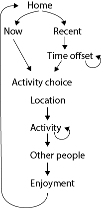

The METER study
=================================

METER is a 5 year research project at the University of Oxford's Environmental Change Institute. It is funded by the Engineering and Physical Sciences Research Council (EPSRC) from 2015-2020 under grant number EP/M024652/1.

Aims
---------------------------------------

METER seeks to improve our understanding of household electricity use, its timing, flexibility and societal importance. By combining high resolution household electricity readings with simultaneous activity records of household members, METER data provides a platform for new analytical insights.

These include among others a more detailed understanding of socio-technical drivers behind

- high and low electricity consumption
- high peak time consumption
- ability to respond the load shifting interventions
- impact of interventions on individuals
- trends in electricity use over time and in response to adoption of new technologies and social practices

Data collection
===============

The data collection process involves the following stages:

#. `Recruitment`_
#. `Household Survey`_
#. `Individual Survey`_
#. `Activity Recording`_
#. :ref:`Electricity Recording <eMeter>`
#. `Follow-up Surveys`_

Each of these steps is briefly explained here.

Recruitment
------------

Thus far METER's participation has been on a voluntary opt-in basis. The following approaches have been used to promote the study:

- Local radio and television appearances
- Public engagement and visiting community events
- :download:`Posters <images/meter_poster3.png>` and flyers
- Working with project partners
- University press release
- Social media
- Snowballing (email existing participants to invite others, with the promise that the person with the most references wins a year free electricity)
- Collaboration with other studies and initiatives

From January 2018 onwards any referrals (one of the ways in which participants learn about the study) are recorded as part of the Household Survey (see `Household.reference` and `Household.referee`).

No explicit rewards are offered, but each year one participant can win the cash equivalent of one year of their electricity bill (see `How it works <http://www.energy-use.org/how_it_works.php>`_)

.. Biases arising from self-section are discussed under :ref:`representativity`.

The section [to provide link] on Recruitment Materials provides examples of advertising used in attracting participants to the METER study.

Household Survey
---------------------------------------

Prospective participants register their interest on energy-use.org by completing a Household survey.

Data collected includes:

- Contact information
    - Name
    - Address
    - Email
- Household composition
    - Number and ages of household members
    - Pets
    - Typical occupancy
- Building
    - House type
    - Size of house
    - Ownership
    - Appliances
- Electricity
    - Supplier
    - Tariff
    - Expenditure
    - Affordability
    - Household income
- Preferred date to take part

See :ref:`questions and optional answers <household-table>` for a detailed break down of the survey.

Meter's `data privacy policy <http://energy-use.org/data_policy.php>`_
is available from the final screen of the Household Survey.

Devices
-----------

Participating households receive an envelope 2-4 days prior to their chosen date. Parcels cannot be posted more than 7 days in advance, because the `eMeter`_ is activated on a given weekday and would discharge prior to arriving.

The envelope contains:

* A :download:`note with instructions <images/Monday.png>` explaining the content of the parcel and next steps

* A prepaid return envelope

* An :ref:`eMeter`

* An :ref:`aMeter` for each household member aged 8 or above

* a booklet explaining the `aMeter`_ (:download:`aMeter instructions <images/17_03_aMeter_booklet.png>`)

Before January 2017 participants received a :download:`paper diary <images/meter_booklet_v10.png>` instead.

Activity and electricity recordings are taken over a 28 hour period starting at 5pm, thus capturing two of the typically most energy intensive periods between 5pm and 7pm. We refer to this 28 hour period as a 'study day'.

.. figure:: images/aMeter.png
    :scale: 20 %
    :align: right

.. _aMeter:

Activity Recorder (aMeter)
---------------------------------------

aMeters are issues as a pre-installed app on a budget smart phone (Alcatel Pixi 4). All other phone features are disabled, except the power button, which can toggle the device on/off. The devices are thus configured to only provide two functions:

#. `Individual Survey`_ completion
#. `Activity Recording`_

The interface is specifically designed to be fail save and intuitive. No sliders, gestures or nested menus exist. All operations are a choice of 6 large buttons on a 2 by 3 grid. The only exception is the home screen where reported activities are chronologically listed in scrollable form.

.. figure:: images/survey.png
    :scale: 60 %
    :align: right

Individual Survey
~~~~~~~~~~~~~~~~~

The `aMeter`_ prompts each participant to complete an Individual Survey covering:

- Consent for data to be used for research
- Personal information
    - Gender
    - Age range
- Work
    - Occupation type
    - Working hours
    - Flexibility of working hours
    - Working from home
- Financial
    - Contribute to electricity bills
    - Personal income
- Frequency/duration of use
    - Appliances (Dishwasher, washing machine...)
    - Activities (Screen time, cooking, exercise...)

See detailed :ref:`questions and data structure <individual>`.

Once the survey is completed the first star lights up on the activity recorder and the reporting of activities will lead to further stars being earned.

Activity Recording
~~~~~~~~~~~~~~~~~~~~

From the home screen a new activity can be entered via the "now" button. If the event is in the past or future, the "recent" button allows for the time to be adjusted, before the entry sequence begins.

The entry sequence follows a standard pattern:

An example of a possible entry sequence is shown here:

.. figure:: images/activitysequence.png
   :scale: 60 %

The decision tree with six branches per screen quickly leads to a detailed description of activities.

.. figure:: images/edit.png
    :scale: 40 %
    :align: right

*Editing an existing activity*

Tapping an activity on the home screen opens up 6 editing options

- add another activity that took place in parallel
- repeat that (past) activity now
- change the caption of the activity (time use code remains unchanged)
- change the time of the activity
- report the activity as ended
- deleting the activity

Section :ref:`activities` explains how activity records are processed and stored.

*Source code*

The meter app is an open source Cordova project available on `github <https://github.com/philgrunewald/meterapp>`_). More information about the app is published by
`grunewald2017 <https://www.eceee.org/library/conference_proceedings/eceee_summer_studies/2017/9-consumption-and-behaviour/what-we-do-matters-8211-a-time-use-app-to-capture-energy-relevant-activities/>`_).

The app keeps function and content separated. All button labels, captions and help files are stored as plain text json files which can be modified or translated without coding experience. A German version of the app has been developed and further internationalisation and customisation is encouraged.

.. Todo
    Phil: I think all files should be part of the deposition. - MD: They are

The `activity files are accessible here <https://github.com/philgrunewald/meteractivities>`_.

.. figure:: images/eMeter_v3_2.png
    :scale: 20 %
    :align: right

.. _eMeter:

Electricity recorder (eMeter)
-----------------------------

eMeters are preconfigured to record electricity over a 28 hour period. Participants need to attach the current clamp beneath their mains electricity meter prior to the study period. Instructions are printed on the case. The eMeter is fully automated and has no switches or other feedback mechanisms.

After use the device is returned and data downloaded, before the unit is recharged and re-deployed. For each user the eMeter is issued with a new ID (see :ref:`meta`), which identifies the data in the file name and each row of data.

*Accuracy*

The current clamp signal is recorded at 44kHz and sampled down to RMS readings of the AC signal every second. Values are stored every second in Watt as a csv text file.

While temporal accuracy is high, the recordings are prone to variations between devices  (~5% error) and distortions when the power factor of loads is low. Some devices, especially motors with poor power factor correction, can lead to artificially high readings. To correct for this error it would be necessary to also record the voltage. This would require users to make a physical connection (for example in the fuse box). This has been avoided thus far.

*Hardware*

In their current form, the duration of electricity recording is limited to ~42 hours by the battery life of the devices. With booster batteries this duration can be extended.

The main failure mechanism is damage to the current clamp. The iron ring is brittle and can break when clipped shut with parts of the cable caught. The flexure of the casing is also prone to tearing. Such damage has been fixed with tape on a few devices.

The hardware is patent protected by Oxford Innovations. See also `other applications <http://www.eci.ox.ac.uk/news/2017/1101.html>`_.

|

.. figure:: images/yourdata.png
    :scale: 40 %
    :align: right

Follow-up Surveys
-----------------

After returning the devices, households receive a link to an interactive visualisation of their electricity profile and activities. The hour of highest electricity consumption is annotated and brought into focus on loading the page.  Participants have the opportunity to provide additional information about appliances that may have been in use during this hour.

Simple statistics about minimum, average and peak usage are shown and compared with the study averages.

Resources
=========

Publications
------------

The following publications give an introduction to the METER study.

 1. `The electricity footprint of household activities - implications for demand models <https://www.sciencedirect.com/science/article/pii/S0378778818306935>`_
     Phil Grunewald, Marina Diakonova,
     *Energy and Buildings* (2018)

     Outlines initial findings and tests the strength of activities to predict electricity use. We conclude that for multi-occupant households in particular the multiplicity of parallel activities does not support the use of activities as a strong indicator of household electricity use. The difference between activities with 'high' and 'low' electricity use is only around 7% at aggregated household level.

 2. `Flexibility, dynamism and diversity in energy supply and demand: A critical review <https://www.sciencedirect.com/science/article/pii/S2214629618300744>`_
     Philipp Grunewald, Marina Diakonova,
     *Energy Research & Social Science* (38) 58-66 (2018)

     The importance of everyday life limiting even largely technical solutions for load shifting is brought into focus through a systematic review of flexibility options.

 3. `What we do matters – a time-use app to capture energy relevant activities <https://www.eceee.org/library/conference_proceedings/eceee_Summer_Studies/2017/9-consumption-and-behaviour/what-we-do-matters-8211-a-time-use-app-to-capture-energy-relevant-activities/>`_
     Philipp Grünewald, Marina Diakonova, Davide Zilli, Jessica Bernard, Adriano Matousek,
     *ECEEE Summer Proceedings* (2017)

     An introduction to the activity recording app and its features

 4. `Measuring the relationship between time-use and electricity consumption <https://www.eceee.org/library/conference_proceedings/eceee_Summer_Studies/2015/9-dynamics-of-consumption/measuring-the-relationship-between-time-use-and-electricity-consumption/>`_
     Philipp Grünewald, Russell Layberry,
     *ECEEE Summer Proceedings* (2015)

     Introducing the methodology for recording activities and electricity alongside each other.

Further publications can be found on Academia.edu: `Academia <https://oxford.academia.edu/PhilippGr%C3%BCnewald>`_

Online Resources
----------------

Meter project developments are disseminated online via:

* `Facebook/EnergyUse <https://www.facebook.com/EnergyUse/>`_
* `Twitter/EnergyUseUK <https://twitter.com/EnergyUseUK>`_
* `Academia/PhilippGrunewald <https://oxford.academia.edu/PhilippGr%C3%BCnewald>`_
* `Energy-use.org <http://www.energy-use.org>`_

In addition, project partners, participants and interested parties receive project updates via email.

|
